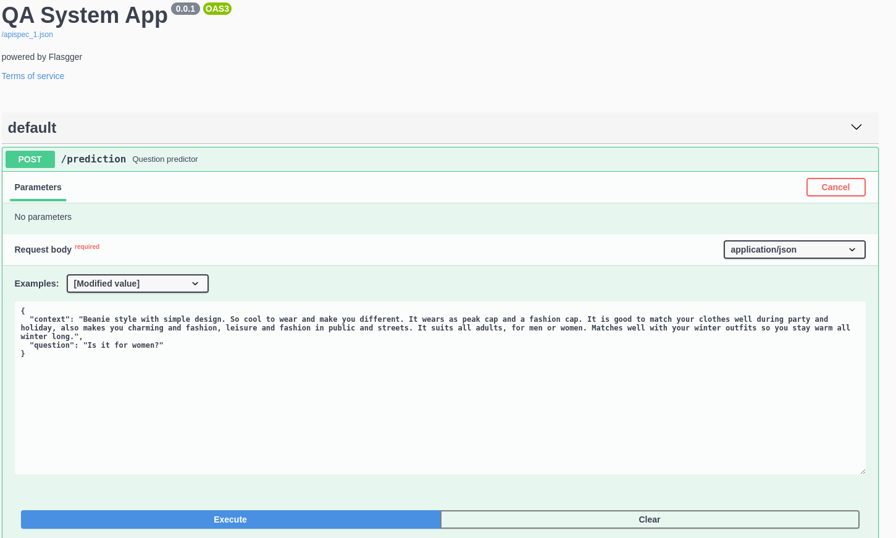
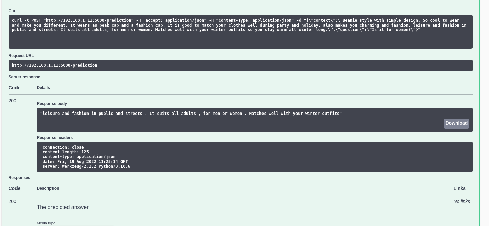

# End to End Question Answering system
## Intro
For this project, we implement a basic question answering system. Namely, the system takes as input a question in natural language and identify the answer in a body of text(s). The system should be built to take input as provided by the dataset described below. 

Inference of the model is introduced as a service, which exposes an http endpoint where a client can post a question and a context expecting to get a relative answer. 

## Project Structure
The design of the complete system is structured in a way to be easily maintained and deployed. For this reason is decomposed into different components serving various purposes. 

## QA Model definition
The model is an adaption from the  [Document Retriever](https://arxiv.org/pdf/1704.00051.pdf) the first model having a great impact in advancing neural question answering approaches. The reason behind adapting this model is that it provides a motive for investigating and designing all those components, that solidify neural translation model models, before the most recent trends e.g transformers. 

The model requires as inputs the context and the question which are vectorized through an extensive preprocessing stage.
The output of the model is the probabilities of the start/end index of the answer with respect to the questin inside the context e.g the span of the answer.

## API Design
Having completed the training and validation process we're set to serve our model via our API. Flask, a popular python based web microframework, is selected for developing the application. Currently our logic is implement on the backend where we expose an endpoint for prediction requests. In later stages, we could enhance our application with a frontend page.

Swagger is used for API documentation and testing our design. By accesing the localhost/apidocs 
you can inspect and test the functionality of our service. Here some examples:



## Project setup
After you clone the project, you need to set up a python virtual enviromenent to install all the requirements necessary for the project with polluting the global namespace and having a better control handling packages over multiple python projects. 

To manage python virtualenvs we use pyenv and pyenv-virtualenv.

Install native dependencies:

```
sudo apt-get install -y make build-essential libssl-dev zlib1g-dev libbz2-dev \
libreadline-dev libsqlite3-dev wget curl llvm libncurses5-dev libncursesw5-dev \
xz-utils tk-dev libffi-dev liblzma-dev python-openssl git
```

Install pyenv and pyenv-virtualenv using pyenv using the [pyenv-installer](https://github.com/pyenv/pyenv-installer)

```
curl https://pyenv.run | bash
```

Add the following commands to ~/.bashrc:

```
export PATH="$HOME/.pyenv/bin:$PATH"
eval "$(pyenv init -)"
eval "$(pyenv virtualenv-init -)"
```

Verify pyenv has been installed correctly:
```
pyenv
```

Install virtual envs for python service:

```
setup_venv.sh
```

### Set up Project

```
cd qa-system
pip install -r requirements.txt
python setup.py build
pip install -e .
sh make_dataset.sh
```

To train the model run from `/qa-system`:
```
python src/train.py
``` 

To run the application run from `/qa-system`:
```
python run.py
```

Then visit the http://127.0.0.1:5000/apidocs to test the application 